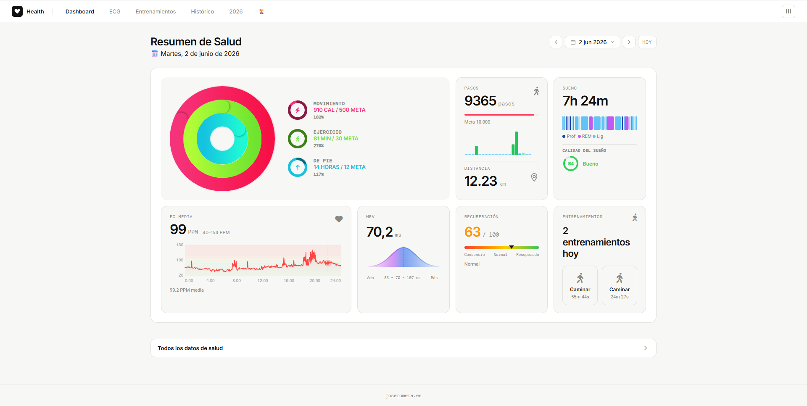
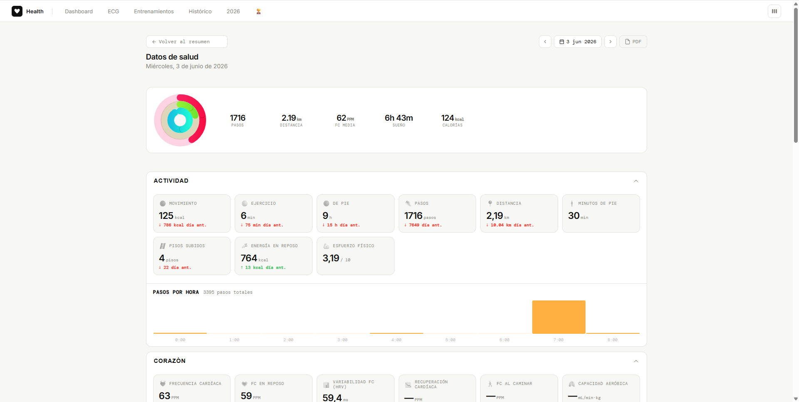

# Health Dashboard — Apple Health

Dashboard personal para visualizar y analizar los datos exportados de Apple Health.





---

## Instalación

```bash
pip install -r requirements.txt
python app.py
```

Abre `http://127.0.0.1:5050` en el navegador.

---

## Configuración

### Variables de entorno (opcionales)

| Variable | Por defecto | Descripción |
|----------|-------------|-------------|
| `HEALTH_USER` | `admin` | Usuario de acceso |
| `HEALTH_PASSWORD` | `admin` | Contraseña inicial (fuerza cambio al primer login) |
| `SECRET_KEY` | Auto-generado | Clave de sesión (se guarda en `data/secret_key.txt`) |
| `PORT` | `5050` | Puerto del servidor |
| `DEBUG` | `0` | Activar modo debug (`1` = activado) |

### Primera vez

Al entrar con `admin` / `admin` el sistema obliga a cambiar las credenciales antes de continuar.

---

## Importar datos

1. En el iPhone: **Salud → tu perfil → Exportar datos de salud**
2. Envía el ZIP al ordenador
3. En el dashboard: **Ajustes → Importar datos** y arrastra el ZIP

---

## Modo Debug

El modo debug activa endpoints adicionales para diagnóstico.

**En Windows** (dos comandos separados):
```
set DEBUG=1
python app.py
```

**En Linux / Mac**:
```bash
DEBUG=1 python app.py
```

> ⚠️ Con `set DEBUG=1 && python app.py` en Windows el `&&` **no** pasa la variable al proceso. Hay que ejecutarlos por separado.

### Endpoints de debug (solo con DEBUG=1)

| URL | Descripción |
|-----|-------------|
| `/api/debug/sleep-hist2` | Diagnóstico del sueño histórico |
| `/api/debug/temp-check` | Datos de temperatura de muñeca |

### Endpoints siempre disponibles

| URL | Descripción |
|-----|-------------|
| `/api/types` | Lista todos los tipos de datos en la BD con conteos y fechas |

---

## Estructura de archivos

```
health_dashboard/
├── app.py                    # Punto de entrada
├── requirements.txt
├── README.md
├── routes/                   # Blueprints Flask
│   ├── main.py               # / → redirige según datos
│   ├── auth.py               # /login /logout /change-password
│   ├── dashboard.py          # /dashboard /api/day
│   ├── health_data.py        # /salud/<date>
│   ├── history.py            # /historico /api/history
│   ├── workout.py            # /workouts /workouts/<idx>
│   ├── ecg.py                # /ecg
│   ├── wrapped.py            # /año/<year>
│   ├── gamification.py       # /logros /api/gamification/*
│   ├── settings.py           # /ajustes /api/settings/*
│   └── debug.py              # Solo con DEBUG=1
├── services/
│   ├── db.py                 # SQLite — todas las queries
│   ├── workout.py            # Parser de entrenamientos
│   ├── ecg.py                # Parser de ECG
│   └── gamification.py      # Rachas, logros, retos
├── templates/                # HTML (Jinja2)
├── static/
│   ├── css/
│   ├── js/
│   ├── sw.js                 # Service Worker (caché offline)
│   ├── manifest.json         # PWA
│   └── favicon.svg
└── data/                     # Generado en runtime (no en git)
    ├── health.db             # Base de datos SQLite
    ├── credentials.json      # Usuario/contraseña hasheados
    └── secret_key.txt        # Clave de sesión persistente
```

---

## Páginas principales

| URL | Descripción |
|-----|-------------|
| `/dashboard` | Resumen del día con métricas clave y anillos |
| `/salud/<fecha>` | Todos los datos de salud de un día |
| `/historico` | Gráficas históricas de todas las métricas |
| `/workouts` | Lista de entrenamientos con mapa de rutas |
| `/workouts/<n>` | Detalle de un entrenamiento con mapa GPS |
| `/ecg` | Registros de ECG |
| `/historico` | Histórico con gráficas por período |
| `/año/<año>` | Resumen anual estilo Wrapped |
| `/logros` | Logros desbloqueados, retos y estadísticas |
| `/ajustes` | Importar datos, credenciales, objetivos, Obsidian, exportar para IA |

---

## Seguridad

- Las credenciales se guardan hasheadas (SHA-256) en `data/credentials.json`
- La SECRET_KEY se genera una vez y se persiste en `data/secret_key.txt`
- Las sesiones duran 30 días
- Todas las rutas requieren autenticación excepto `/login` y `/sw.js`
- Los endpoints de debug solo están activos con `DEBUG=1`

---

## Requisitos

- Python 3.10+
- Ver `requirements.txt` para dependencias

